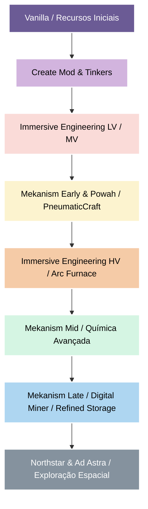

# ⚙️ Foundry & Frontier

Bem-vindo ao **Foundry & Frontier**, um modpack técnico focado em engenharia industrial avançada, automação encadeada e exploração espacial no Minecraft 1.20.1.

Diferente de modpacks técnicos convencionais onde você pode fabricar blocos de alta tecnologia logo no primeiro dia, **Foundry & Frontier** exige a criação de uma base sólida. Você precisará trilhar uma árvore tecnológica rebalanceada onde cada mod serve como degrau obrigatório para o próximo nível de automação.

---

## 🚀 A Proposta e Progressão Industrial

O modpack impõe uma cadeia de progressão estruturada e integrada via KubeJS. A árvore de tecnologia industrial segue a seguinte lógica:

### 🪵 Era 1: Mecânica e Ligas Básicas (Create & Tinkers' Construct)
* **Geração Cinética:** Aproveite a força da água e do vento para moagem, mistura e processamento inicial de materiais.
* **Fundição:** Monte sua Smeltery do Tinkers' para derreter metais e gerar ligas fundamentais como Latão (Brass).
* **Metalurgia Canônica:** A unificação do aço exige a fundição de ferro líquido com carvão em pó na Smeltery (`5 iron + 1 coal dust = 5 steel ingots`), estabelecendo a base da metalurgia.

### 🔌 Era 2: Eletricidade Industrial LV/MV (Immersive Engineering)
* **Introdução à Eletricidade:** Use fiação aérea de cobre e geradores cinéticos para gerar suas primeiras fontes de RF/FE.
* **Componentes Elétricos:** Produza capacitores de baixa e média tensão (LV/MV), fios revestidos e bobinas magnéticas necessárias para fabricar os cérebros de controle das primeiras máquinas avançadas.

### 💨 Era 3: Automação e Pressão (PneumaticCraft, Powah & Mekanism Early)
* **Mecânica Hidropneumática:** Use compressores e tubulações do PneumaticCraft para refinar plástico e borracha.
* **Gating Tecnológico:** As primeiras máquinas básicas e o Metallurgic Infuser do Mekanism agora exigem chassis industriais e unidades de controle eletromecânicas fabricadas na infraestrutura do Immersive Engineering.
* **Energia Térmica:** O Thermoelectric Generator e o Heat Generator exigem núcleos de regulação térmica e balanceamento térmico real para evitar fontes infinitas de energia no início de jogo.

### 🧪 Era 4: Alta Tecnologia (Mekanism Late & Refined Storage)
* **Alta Tensão (HV):** A confecção de placas e ligas de alta fidelidade como o *Quartz Enriched Iron* exige o uso obrigatório do **Arc Furnace** (Forno a Arco Voltaico) da era de Alta Tensão de IE.
* **Química Avançada:** Desbloqueie o processamento de gases, purificação de minérios em múltiplos estágios e super-condutores no Mekanism.
* **Processadores e Silício:** O Refined Storage foi completamente rebalanceado. Esqueça os processadores crus e cozimento em fornos: as bases de silício puro devem ser dopadas e fundidas utilizando infusões químicas específicas no Metallurgic Infuser do Mekanism.
* **Mineração Digital:** Automatize a mineração global utilizando o Digital Miner, cujo custo de confecção requer a avançada Matriz de Controle de Escavação (exigindo brocas industriais de alta precisão).

### 🌌 Era 5: A Fronteira Espacial (Northstar & Ad Astra)
* **Viagem Interplanetária:** Construa foguetes refinando combustíveis compatíveis e gerando oxigênio e hidrogênio pressurizados em eletrólises de alta potência.
* **Colonização:** Construa bases herméticas e explore o espaço, a Lua e planetas distantes, utilizando toda a automação tecnológica construída na Terra.

---

## ⚡ Novidades do Patch v2.1.0

A versão `v2.1.0` adiciona novas mecânicas de transmissão e física elétrica:
* **Create: New Age:** Adiciona geração elétrica ao Create via bobinas giratórias e reatores nucleares modulares.
* **More Create Burners:** Habilita aquecedores elétricos e flexíveis integrados para as fornalhas e máquinas.
* **Create: Power Grid:** Simula redes de energia baseadas na Lei de Ohm, exigindo atenção com resistores, capacitores e sobrecargas reais de circuitos.

---

## 🛠️ Instalação

O modpack foi projetado para rodar no **Prism Launcher** ou **PolyMC**.

1. Baixe o ZIP da release atual no repositório.
2. No Prism Launcher, clique em **Adicionar Instância** -> **Importar** (ou arraste e solte o arquivo ZIP da instância).
3. Certifique-se de que a instância esteja configurada para rodar com **Java 17**.
4. Inicie o jogo e divirta-se!

---

## 📝 Licença e Contribuição

Este modpack é de código aberto e mantido de forma privada para a comunidade de jogadores do **Foundry & Frontier**.
Para relatar bugs de receitas ou crash reports, abra uma Issue no repositório público do GitHub.
